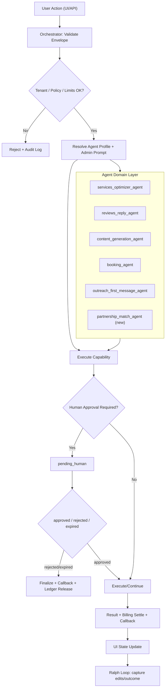

# Agent Registry v1 (LocalOS + OpenClaw)

Дата: 11 марта 2026  
Статус: Active

## Цель
Единая схема агентной системы LocalOS:
- что является агентом (доменная роль),
- что является capability (исполняемая операция),
- что делает orchestration-layer (policy/approval/billing/audit/retry),
- как работает Ralph loop (обучение от правок и исходов).

## Базовые определения
- `Agent`: доменный исполнитель (например, оптимизация услуг, ответы, бронирование, партнёрства).
- `Capability`: контрактная операция (например, `services.optimize`).
- `Orchestrator`: управляющий слой выполнения (`tenant guard`, `policy`, `approval`, `idempotency`, `billing`, `callbacks`).
- `Harness`: runtime вокруг модели, который собирает контекст, показывает доступные tools/capabilities, валидирует вызовы, применяет permissions, пишет traces и возвращает observations.
- `Tool`: узкий типизированный контракт, который модель может запросить, но выполняет только harness/orchestrator.
- `Goal`: долгоживущая, но ограниченная цель с budget, checkpoints, validation и stop condition.
- `Intent`: тип бизнес-сценария:
  - `operations`
  - `client_outreach`
  - `partnership_outreach`

## Канонические правила
1. Любой agent-run обязан иметь: `tenant_id`, `actor`, `trace_id`, `idempotency_key`, `capability`, `billing`.
2. Оркестратор не заменяется агентом: это слой исполнения и безопасности.
3. Источник промптов для production-agent'ов: Административная панель (template store), не hardcode.
4. Любые исходящие касания клиенту/партнёру идут через human approval.
5. Outreach dispatcher is opt-in: Agent Blueprint may only queue approved drafts; real delivery starts only from the separate dispatcher contour when `OUTREACH_DISPATCH_ENABLED=true` or a privileged admin dispatch endpoint is used.
6. Blueprint capabilities with risky words such as `send`, `publish`, `payment`, `delete`, `destructive`, or `mass` require an approved human gate. For supervised outreach send, the required gate is `approval_type=drafts`, not just any earlier approval.
7. Ralph loop общий для аутрича и партнёрств, но с жёсткой сегментацией по `intent`.
8. Модель не исполняет side effects напрямую: она предлагает tool/capability call, а harness валидирует, авторизует, исполняет или возвращает `pending_human`/denial.
9. Любой tool/capability call обязан получить структурированный result: success, validation error, permission denial, timeout, `pending_human` или failure.
10. Для долгих задач goal-loop управляет исполнением; Ralph loop собирает learning signals после human edits/outcomes.

## Harness Boundary

LocalOS разделяет роли модели и runtime:

- модель интерпретирует задачу, выбирает следующий шаг, запрашивает tool/capability и синтезирует observations;
- harness/orchestrator собирает контекст, проверяет envelope, валидирует аргументы, применяет tenant/policy/approval/billing rules, пишет ledger/traces и выполняет callbacks;
- внешние публикации, отправки, платежи, destructive actions и действия в third-party systems требуют approval record вне prompt.

Каноничный loop:

```text
context builder
  -> model call
  -> tool/capability proposal
  -> schema validation
  -> permission/approval check
  -> execute, deny, or pending_human
  -> structured observation
  -> next step or final response
```

Подробный runtime guide: [docs/agents/harness-architecture.md](agents/harness-architecture.md).

## Event Model

Agent runtime должен быть отлаживаемым через typed events, а не только через историю чата.

Рекомендуемые события:

- `user_message`
- `assistant_message`
- `model_call`
- `tool_call`
- `tool_result`
- `permission_decision`
- `approval_request`
- `approval_result`
- `plan_update`
- `goal_update`
- `context_compaction`
- `callback_attempt`
- `error`
- `final_answer`

Trace должен отвечать: что агент пытался сделать, какие данные использовал, какое действие изменило состояние, кто подтвердил действие, что сломалось и почему run остановился.

## Goal Loop vs Ralph Loop

`Goal loop` и `Ralph loop` не заменяют друг друга.

| Loop | Назначение | Где применять |
| --- | --- | --- |
| `Goal loop` | безопасно довести ограниченную цель до done/blocked/pending_human | outreach batches, partnership shortlist, многошаговые ops-задачи |
| `Ralph loop` | учиться на human edits, outcomes и результатах отправок | тексты услуг, ответы, новости, outreach/partnership outcomes |

Goal-loop state должен иметь objective, `intent`, budget, checkpoints, validation, forbidden actions и stop condition. Ralph-loop signal сохраняет draft/final/outcome/edit distance/intent/agent/capability.

Подробный guide: [docs/agents/planning-and-goals.md](agents/planning-and-goals.md).

## Реестр агентов (v1)

### 1) Services Optimizer Agent
- Agent id: `services_optimizer_agent`
- Intent: `operations`
- Capabilities: `services.optimize`
- Input:
  - карточка услуги (name/description/category/price)
  - tone/language
  - prompt template из админки
- Output:
  - SEO-формулировка названия
  - SEO-описание
  - keywords
- Approval: required by default
- UX requirement:
  - обязательно редактирование до принятия (edit-before-accept).
- Learning metrics:
  - `% accepted_raw`
  - `% edited_before_accept`
  - `median_edit_distance`
  - `tokens_per_accept`

### 2) Reviews Reply Agent
- Agent id: `reviews_reply_agent`
- Intent: `operations`
- Capabilities: `reviews.reply`
- Input:
  - review text
  - tone/language
  - prompt template из админки
- Output: reply draft
- Approval: required by default
- Learning metrics:
  - `% accepted_raw`
  - `% edited_before_accept`
  - `% rejected`

### 3) News / SMM Copy Agent (эволюционный)
- Agent id: `content_generation_agent`
- Intent: `operations`
- Capabilities:
  - current: `news.generate`
  - next: `social.post.generate` (planned)
- Input:
  - service/event/offer context
  - tone/language
  - prompt template из админки
- Output:
  - news draft
  - (planned) social post variants
- Approval: required
- Learning metrics:
  - `% published`
  - `% edited_before_publish`
  - `tokens_per_publish`

### 4) Booking Agent
- Agent id: `booking_agent`
- Intent: `operations`
- Capabilities:
  - `appointments.create`
  - `appointments.update`
  - `appointments.cancel`
  - `reminders.send`
- Input:
  - client/request context
  - channel context
  - business policies
- Output:
  - booking action result
  - reminder delivery result
- Approval:
  - спорные действия: required
  - безопасные confirm-path: policy-based

### 5) Outreach First Message Agent
- Agent id: `outreach_first_message_agent`
- Intent: `client_outreach`
- Capabilities:
  - draft generation in outreach flow
  - dispatch via queue/batch
- Input:
  - lead snapshot
  - channel
  - value angle
  - prompt template из админки
- Output: first message draft
- Approval: required
- Learning metrics:
  - `reply_rate`
  - `hard_no_rate`
  - `% edited_before_send`

### 6) Partnership Match Agent (new)
- Agent id: `partnership_match_agent`
- Intent: `partnership_outreach`
- Capabilities (new):
  - `partnership.audit_card`
  - `partnership.match_services`
  - `partnership.draft_offer`
- Input:
  - your services
  - partner services/profile
  - city/type constraints
  - prompt template из админки
- Output:
  - match score
  - overlap/complement map
  - draft offer letter
- Approval: required
- Learning metrics:
  - `match_accept_rate`
  - `partner_reply_rate`
  - `% edited_before_send`

## Capability map (current + planned)

### Current
- `services.optimize`
- `reviews.reply`
- `news.generate`
- `appointments.create`
- `appointments.update`
- `appointments.cancel`
- `reminders.send`
- `sales.ingest`

### Planned (partnership track)
- `partnership.audit_card`
- `partnership.match_services`
- `partnership.draft_offer`
- `social.post.generate` (as part of content agent evolution)

## Ralph loop (единый контур обучения)

### Signal schema (conceptual)
- `intent`
- `agent_id`
- `capability`
- `draft_text`
- `final_text`
- `outcome`
- `edited_fields`
- `editor_user_id`
- `channel`
- `business_type`
- `created_at`

### Outcome taxonomy
- `accepted_raw`
- `edited_accepted`
- `rejected`
- `positive_reply`
- `question_reply`
- `no_response`
- `hard_no`

## BPMN-like схема (Mermaid)



## Важные UX требования (обязательные)
1. Для `services.optimize`, `reviews.reply`, `news.generate`:
- всегда есть inline-edit до кнопки принятия.
2. Источник prompt:
- только шаблоны из админ-панели + user preferences (tone/language/examples).
3. Для `partnership_outreach`:
- тот же pipeline, что outreach, но отдельный `intent` и отдельные метрики.

## Что обновлять при добавлении нового агента
1. Добавить агент в этот реестр.
2. Добавить capability в контракт и orchestrator map.
3. Добавить approval policy.
4. Добавить learning signals + dashboard metrics.
5. Обновить README секцию документации.
