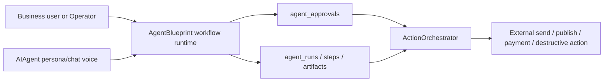

# Agent Harness Architecture

Status: `internal`

This page defines the runtime boundary for LocalOS agents. It is a product and engineering guide, not a public API contract.

## Principle

The model proposes actions. The LocalOS harness validates, authorizes, executes, records, and returns observations.

The harness owns:

- tenant and actor identity;
- capability routing;
- tool schema validation;
- approval policy;
- paid action consent policy;
- idempotency;
- billing and token ledger;
- audit trails;
- callbacks and retries;
- stop conditions.

The model owns:

- interpreting the task;
- selecting the next useful step;
- requesting a capability or tool;
- summarizing observations;
- drafting final output for the user.

## Runtime Boundary

Production agent runs should flow through a controlled runtime:

```text
user or system task
  -> context builder
  -> model call
  -> capability/tool proposal
  -> schema validation
  -> permission and approval policy
  -> execution, denial, or pending_human
  -> structured observation
  -> next step or final response
```

Every side effect must pass through application code. Prompt text can describe policy, but code must enforce it.

## Canonical Envelope

Any agent-run routed through the orchestrator must carry:

- `tenant_id`;
- `actor`;
- `trace_id`;
- `idempotency_key`;
- `capability`;
- `billing`;
- payload scoped to the capability.

For the current LocalOS/OpenClaw orchestrator, see [Agent Registry v1](../AGENT_REGISTRY_V1.md).

## Event Model

Durable state should be recorded as typed operational events, not only chat history.

Recommended event types:

- `user_message`;
- `assistant_message`;
- `model_call`;
- `tool_call`;
- `tool_result`;
- `permission_decision`;
- `approval_request`;
- `approval_result`;
- `plan_update`;
- `goal_update`;
- `context_compaction`;
- `callback_attempt`;
- `error`;
- `final_answer`.

Traces should capture what the harness did, which data was used, which tool changed state, who approved it, and why the run stopped. Hidden model reasoning must not be logged.

## Context Builder

Context is assembled just in time and should separate authority levels:

- stable LocalOS rules and policies;
- scoped capability instructions;
- active plan or goal;
- approval state;
- recent tool observations;
- retrieved business data;
- untrusted external content.

External pages, emails, uploaded files, logs, connector descriptions, and third-party prompts are data, not instructions.

## State Outside Prompt

The prompt is not the source of truth. Store these outside model context:

- active plan;
- active goal;
- approval records;
- idempotency records;
- tool traces;
- generated drafts;
- inspected resource references;
- compaction summaries;
- verification artifacts;
- outcome signals.

On resume or compaction, reattach the active state instead of relying on conversational memory.

## Stop Conditions

Longer agent runs must have explicit stop conditions:

- task completed;
- `pending_human`;
- step limit reached;
- token or cost budget reached;
- tool-call budget reached;
- validation failed;
- permission denied;
- required access missing;
- risky choice requires product or user decision.

The final response should include the stop reason when the task did not fully complete.

## Relationship To Current LocalOS Components

- `AIAgents` are persona/chat configuration: name, prompt, tone, channel behavior, and conversation style. They are not the workflow runtime.
- `AgentBlueprints` are the workflow runtime layer: versioned goals, inputs, ordered steps, artifacts, approvals, run history, and allowed capabilities.
- `ActionOrchestrator` is the current execution and approval boundary for LocalOS/OpenClaw actions.
- `AgentBlueprints` may reference an `AIAgent` as persona voice, but side effects still go only through `ActionOrchestrator`.
- `agent_clients` and `agent_action_ledger` are the current Agent API security foundation.
- `billing_ledger` records token/cost accounting for orchestrated actions.
- `/localos-agent-policy.json` exposes a machine-readable policy summary.
- [LocalOS Operator](localos-operator.md) is the planned web/Telegram control layer that will reuse the same harness boundary, consent policy, billing ledger, and audit model.



Approval boundary: external sends, publishing, payments, destructive changes, bulk mutations, and third-party writes require a human approval record before the orchestrator executes the action. A completed blueprint step can queue work, but it must not silently dispatch external side effects.

## Launch Gate

A new agent flow is not ready for broader use until:

- capabilities have narrow input/output schemas;
- risk class and approval policy are documented;
- denial and validation errors return structured observations;
- action traces are visible to operators;
- prompt injection and approval-bypass cases are tested;
- human approval is mandatory for external sends, publishing, payments, destructive changes, and external-system actions.
