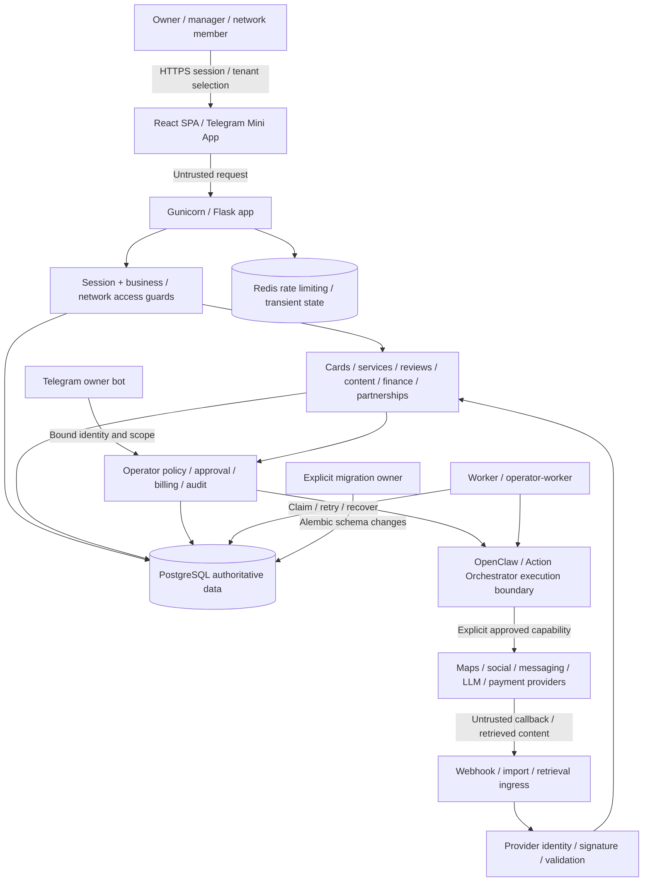

# LocalOS system map — audit working record

Source baseline `30262a5b`. References: `README.md`, `PRODUCT.md`, `AGENTS.md`, `docker-compose.yml`, `docs/LOCALOS_AGENT_ARCHITECTURE_V1.md`. Runtime checks remain incomplete.

## Product and users

LocalOS helps local business owners/managers, local SEO specialists and multi-location networks turn card/review/content/finance/partnership signals into reviewed actions. A successful journey ends with an observable result or a clear recoverable next action, not merely creation of an internal object. Superadmin is a separate platform scope; business and network memberships are tenant boundaries.

The demo audience is a prospective strategic partner and their CTO/due-diligence
team. The shown actor is a synthetic business owner, not a platform superadmin.
The partner should see readable business context, a prepared review response,
a content draft, finance preview/approval and supervised partnerships; the CTO
should be able to follow tenant, approval and execution boundaries and reproduce
checks from the runbook. Real customer data, credentials and production-admin
surfaces are excluded. The planned10–15minute sequence and fallback limitations
are in `08-partner-demo.md`; its rehearsal is still incomplete.

## Components, flow and trust boundaries

Provider content/model output are data, not authorization. Signing callbacks does not authorize arbitrary business actions. Dangerous tools must enforce human approval, scoped identity, billing/policy and audit outside prompts.

## Runtime inventory

| Component | Responsibility / source | Important state |
| --- | --- | --- |
| Flask app | `src/main.py`, `src/api/`, `src/legacy_routes/`; HTTP API and SPA | Sessions, request authorization, domain transactions |
| React frontend/public site | `frontend/src/App.tsx`, routes and feature modules; Vite/TypeScript | Browser session/business selection, draft/review state |
| Main worker | `src/worker.py`; parser/jobs and recovery | PostgreSQL claims; `FOR UPDATE SKIP LOCKED` path |
| Operator worker/bot | Compose services and Operator/Telegram modules | Scope-bound commands, confirmations, action journal |
| PostgreSQL 16 + pgvector | Canonical relational runtime database, 168 tracked Alembic version files | Tenants, memberships, business data, approvals, queue and audit |
| Redis | Shared limiter/transient service | Not the durable business source of truth |
| Upload/debug/audio files | Runtime writable storage | Potential private content; separate from read-only source |
| External execution | OpenClaw/orchestrator and provider clients | Timeouts, retries, uncertainty, consent and provider IDs |

Tracked inventory is intentionally not expressed as brittle file counts here. Use the current committed tree for exact paths; file totals are neither coverage nor a runtime-readiness signal.

### Deployment variants and execution ownership

Source inventory rechecked at `644ef322`, without rendering environment values,
starting services or asserting that optional profiles are enabled in production.

| Manifest / component | Entry point and boundary |
| --- | --- |
| `docker-compose.yml` | Base services: `redis`, `postgres`, `app`, `worker`, `operator-worker`, `telegram-bot`. App uses Flask/Gunicorn; `worker` runs `src/worker.py`; `operator-worker` separately runs `src/operator_worker.py`; bot runs `src/telegram_bot.py`. |
| `docker-compose.workers.yml` | Optional role split: existing `worker` becomes parser-only; `worker-agent`, `worker-operator`, `worker-dispatcher`, `worker-maintenance` use the same worker entrypoint with explicit roles. `worker-operator` and base `operator-worker` are distinct services, not interchangeable names. |
| `docker/compiled-script-runner/compose.fragment.yml` | Adds digest-referenced `compiled-script-runner` on an internal network; connects app/worker/worker-agent to it. Read-only root, dropped capabilities, process/memory/CPU limits; policy admission remains outside untrusted script input. |
| `docker-compose.release.yml` | Opt-in immutable app/worker/Operator/bot images without source binds, named writable data volumes, and explicit `migrator` under `release-migrate`. This is not an activated production release. |
| `docker-compose.staging.yml` + `docker-compose.compiled-staging.yml` | Synthetic environment plus loopback `audit-ingress` proxy (`docker/audit-ingress/proxy.py`); app has no host port and workers/dispatchers/bot are disabled. Current audit runtime is not the current source image. |
| `docker-compose.today.yml` | App/worker feature-flag overlay; no additional service or automatic-send authority. |
| `docker-compose.test.yml` | Test-only app override mounts the Docker socket for testcontainers. This grants daemon access and must not be treated as the isolated production/release profile. |
| `Dockerfile`, `Dockerfile.telegram`, runner Dockerfile | Application/frontend image, bot extension and separate compiled runner build surfaces. `deploy/Dockerfile.operator-voice` is an audio-dependency overlay on a supplied base image, not another application entrypoint. |

`src/services/worker_ownership.py` validates roles and defaults to `all` when
no split role is supplied. The loop in `src/worker.py` owns parser queues;
dispatcher outreach/content/notifications/callback work; maintenance knowledge,
enrichment/billing/renewals/tracking/retention; agent schedules/run and sheet
queues; and Operator async jobs. Due-time checks and per-feature flags select
work within each role. This inventory does not claim that every feature is
enabled, that no schedules overlap, or that source inspection proves replay
safety; the relevant concurrency/approval tests remain separate evidence.

### Scheduled operations and CI

These are checked-in declarations, not observations of installed/enabled host
units or completed GitHub runs. No timer or workflow was dispatched for this
inventory pass.

| Definition | Schedule / executed surface |
| --- | --- |
| `ops/systemd/localos-disk-monitor.{service,timer}` | Two minutes after boot, then every five minutes: `scripts/check_disk_usage.sh`. |
| `ops/systemd/localos-journey-monitor.{service,timer}` | Same cadence: `docker compose exec -T app python /app/src/journey_health_check.py`. |
| `ops/systemd/localos-storage-maintenance.{service,timer}` | Daily host-local03:30 plus up to15minutes randomized delay: `scripts/run_storage_maintenance.sh`; persistent timer. It is a data-retention surface, not permission to run cleanup in this audit. |
| `.github/workflows/quality-fast.yml` | Main push/PR/manual: `scripts/ci_gate_fast.sh` (F821, focused backend, compileall, frontend unit/lint/typecheck/build). |
| `.github/workflows/quality-nightly.yml` | Declared01:17UTC daily/manual: `scripts/ci_gate_nightly.sh`, isolated PostgreSQL, full backend and frontend checks, mocked browser scenarios; separate read-only production `/health` request. |
| `.github/workflows/openclaw-phase-gate.yml` | Main push/PR/manual: isolated backend/PostgreSQL contracts, compiled-runner Docker test, selected frontend tests, lint/typecheck/both builds. |
| `.github/workflows/staging-real-api-nightly.yml` | Declared02:43UTC daily/manual: `scripts/ci_real_api_staging.sh`, synthetic real-API browser journeys and retained artifacts; no real provider credentials or production target. Hosted execution remains unverified. |

All three current systemd services declare `/opt/seo-app` as working directory.
The files under `archive/legacy-runbooks/systemd-services/` are legacy records,
not additional canonical runtime services. Base Docker PostgreSQL, not archived
SQLite/systemd instructions, remains authoritative.

### Baseline formatter availability

The baseline requirement is to run available checks. `frontend/package.json`
defines lint/typecheck/tests/builds but no formatter command. The tracked tree
contains no Prettier/Black/Ruff/Biome configuration or root `pyproject.toml` /
`setup.cfg` formatter gate, and the canonical CI scripts do not invoke one.
Therefore a separate formatter baseline is **not configured**, not a passing
check. Domain utilities named `format_cookies.py` or `features/telegram/format.ts`
are not code formatters. No new formatter dependency or mass rewrite is added
solely to turn this inventory entry green.

### Stage-0 baseline evidence checklist

Baseline is `30262a5b`, not the current release. The raw directory below means
`.agent/tasks/production-readiness-20260917/raw/`; every existing capture keeps
its actual argv, cwd, exit, elapsed time and bounded logs. Failures/truncation
are retained. Missing historical detail cannot be reconstructed as a success
from a later test. This checklist records coverage, not a new execution.

| Requested baseline item | Durable evidence / disposition |
| --- | --- |
| Locked dependency installation | `baseline-frontend-install.json`: npm exit0,10.461s. Backend had no complete lock and reused local dependencies; no clean locked-backend-install proof. Later constraints/base pins do not rewrite this baseline. |
| Build | `baseline-frontend-build.json`: both builds exit0,25.266s, third-party annotation warnings retained. |
| Lint | `baseline-frontend-lint.json`: exit0,13.984s,0errors/1existingwarning. Python scope is the F821 check below, not a complete style gate. |
| Formatter | Not configured, as established above; no formatter PASS is claimed. |
| Typecheck | `baseline-frontend-typecheck.json`: app+Node configs exit0,34.838s. |
| Unit tests | `baseline-frontend-unit.json`:557passed/121files,149.304s. Backend unit/integration results are combined below. |
| Backend/integration tests | `baseline-backend-tests.json`:exit1,257.034s;3542passed/19failed/691skipped/1error. Missing DB/provider fixtures and failures are not silently excluded. |
| End-to-end tests | `baseline-frontend-e2e.json`:72mocked-browser passes,102.145s, not real API proof. `baseline-real-api-e2e.json`:exit130,449.607s, interrupted during locale diagnosis; later95pass/19fail is a separate corrected-harness run. |
| Dependency audit | `baseline-frontend-audit.json`:npm exit0,1.844s,0reported vulnerabilities at capture. `baseline-dependencies-config.json`:Trivy command exit0,49.839s, but detailed JSON was written to an ephemeral path now absent. Its package/misconfiguration/license results are missing; command success is not clean audit evidence. |
| Secret scan | `baseline-secrets-source.json`:exit1,34.643s; `baseline-secrets-history.json`:exit1,563.931s. Triage and historical revocation gap are recorded in SECURITY/threat-model; no credential values belong in this map. |
| Static analysis | `baseline-python-f821.json`:exit0,0.442s with documented fragment exclusions; does not prove all Python lint rules. |
| Application startup | Historical synthetic staging/smoke was observed, but the referenced `/tmp/localos-readiness-staging-smoke.log` is now absent and no standalone baseline start capture is preserved. Later image/runtime/browser proofs do not recreate that missing historical record. |
| Docker build | `baseline-docker-build.json`:ARM64 exit0,375.375s, browser download disabled. Stdout is explicitly truncated; no claim of complete original build logs or browser-enabled/current-image coverage. |
| Migrations | `baseline-migrations.json`:fresh isolated Alembic upgrade exit0,11.852s, head20260907_001. Later rollback/full restore evidence is distinct. |

On18September the exact ephemeral Trivy output and startup log paths above
were rechecked and absent. Do not infer zero findings or a passing startup from
that absence. AC1 stays incomplete where original audit surfaces remain
unchecked; AC5/AC6 separately require current image, dependency and runtime proof.

## Five critical journeys selected for measurement

1. **Access and tenant selection:** sign in → select permitted business → dashboard; expired/inactive/foreign-tenant denial. `auth_admin.py`, `auth_system.py`, `core/auth_helpers.py`.
2. **Service menu change:** view current services → compression/group proposal → review → apply once → see preserved archive/new menu; concurrent apply and rollback integrity. `src/api/services_api.py`.
3. **Finance import:** parse/preview synthetic import → duplicate validation → explicit apply → KPI/history; no cross-tenant writes or partially committed batch. `src/api/finance_api.py`.
4. **Content plan to reviewed draft:** select business → generate/mock draft → review → approval → safe provider stub outcome; no publish merely from preview. `content_plans` / `social_posts` APIs and services.
5. **Operator governed action:** request → scoped proposal → preflight/review → explicit confirmation → journal result, including denied/cancelled/provider-timeout paths. `src/api/operator_api.py`, agent/orchestrator services.

Supervised outreach, reviews and Telegram are mandatory adjacent coverage, including no-send and stop-on-reply. They are not omitted because only five journeys receive the primary performance table.

## Identity, roles and organization boundaries

This describes the canonical helpers, not proof that every caller uses them.
Current production flag values were not inspected in this source-only pass.

| Entry surface | Source and trust rule |
| --- | --- |
| Password login / bearer API | `src/legacy_routes/auth_admin.py`, `src/auth_system.py`, `src/core/auth_helpers.py`: login creates a stored session; request helpers resolve Bearer tokens through `verify_session`, including expiry and inactive-user rejection. |
| Browser cookie session | `src/core/browser_session.py`: opt-in `BROWSER_COOKIE_AUTH_ENABLED` (source default false), HttpOnly `localos_session`; unsafe cookie-authenticated requests require matching `localos_csrf` / `X-CSRF-Token` except listed auth bootstrap routes. An explicitly supplied Authorization header takes precedence. The middleware is registered in `src/main.py`. |
| Telegram Mini App | `src/services/telegram_webapp_auth.py`, `/api/operator/telegram/bootstrap` in `src/api/operator_api.py`: verify signed init_data and auth_date, then resolve Telegram ID to an active LocalOS user. Not a substitute for business/action authorization. |
| Provider webhooks | `src/ai_agent_webhooks.py`, `src/core/telegram_webhook_auth.py`: business-bound Telegram secret header; old raw-token URL returns410; WhatsApp raw-body HMAC. `src/api/telegram_opportunity_radar_api.py` separately checks the configured OpenClaw webhook signature. Rebind/configuration and replay protection are separate deployment obligations. |

`verify_business_access` checks an active business plus session scope and allows
business ownership, active direct membership, active network membership, network
ownership or superadmin. A demo session additionally requires its exact scoped
business. `business_members` and `network_members` migrations20260729_002/001
define manager/member/viewer roles and active/revoked status with one membership
per user/scope. Read access deliberately does not distinguish active member roles.

`verify_business_write_access` first requires that read boundary, then permits
business owner/superadmin, network owner or an active non-viewer direct/network
role. The SQL explicitly includes a synthetic `network_owner` role. Viewer-only
membership cannot authorize mutation; holding another active writable membership
preserves write access. Stored object targets must be rechecked, not authorized
only by a client-supplied current-business selector. Tests/fixes in the backlog
prove selected route families, not universal coverage of every API.

The product tenant root is a business or network, not a separate generic
organizations table. `src/database_manager.py` creates the network/parent-business
relationship and locations reference `network_id`. Separately, companies and
company_locations form a public identity registry linked through
business_company_links (`src/services/company_registry_service.py`,
`src/api/company_registry_api.py`); a shared company row is not tenant access.
Private knowledge, membership and workstreams retain their own scope.

## External dependencies and criticality

Source-supported clients below are **not** evidence of configured credentials,
provider approval, reachability or a successful live write. Audit tests use
synthetic data and stub transports; no provider was called for this inventory.

| Journey / adjacent surface | Primary source and dependency | Failure/approval boundary |
| --- | --- | --- |
| Login and tenant selection | Stored sessions/PostgreSQL; registration verification uses `src/core/email_delivery.py` (configured SMTP) through auth routes | Ordinary session reads do not need a live model. Registration mail delivery is a distinct external dependency, not proved by stubbed auth tests. |
| Service compression | `src/api/services_api.py` → `src/core/service_catalog_compression.py` | Deterministic internal proposal/apply path; changing the LocalOS menu does not automatically update map providers. |
| Finance file preview/apply | `src/api/finance_api.py` → `src/core/finance_imports.py` | CSV/XLSX parsing and approved internal DB updates do not require a live CRM write; image/AI-assisted imports are separate paths. |
| Content/review drafting | `src/services/content_plan_service.py`, `src/services/operator_review_reply_bulk.py`, GigaChat client plus `src/services/llm/{gateway,adapters}.py` | GigaChat configuration is required for live generation. Optional DeepSeek routing depends on flags/business allowlist; empty keys/source support are not availability. A draft is not a publication. |
| Governed Operator execution | `src/services/operator_core.py`, `src/core/action_orchestrator.py`, `src/services/agent_domain_request_executors.py` | Policy, scope, subscription/approval and durable journal precede approved effects; model output supplies no authority. OpenClaw endpoint/credentials are separate configuration. |
| Map-card ingestion / external reviews | `src/yandex_business_parser.py`, `src/yandex_business_sync_worker.py`, `src/google_business_sync_worker.py`; Apify/provider paths in worker and integrations | Provider access, captcha/rate limits and source freshness can degrade ingestion. The legacy Google review-reply route requires owner/superadmin access and a caller-supplied `approved:true` flag: request confirmation, not a durable approval workflow. Operator manual marking only records a reported outcome. `docs/agents/operator-capability-coverage.md` still treats generic external review publication as a manual/gap boundary. |
| Social / Telegram / VK | `src/services/social_posts/{dispatch_reports,recommendations_handoff,provider_adapters}.py`, `src/core/channel_delivery.py`, `src/core/telegram_userbot.py` | Bot API channel sender and MTProto business account are distinct identities. Approved recipient/account/content, provider receipt and uncertainty handling are required; source routing/manual fallback is not live provider-write proof. |
| Partnerships / outreach | `src/api/prospecting/audit_generation.py`, `src/services/outreach_email_adapter.py`, `src/services/outreach_vk_adapter.py` | Approved draft/capped dispatch, sender authority, stop-on-reply and durable receipt/reconciliation; manual channels remain manual. No real sends during audit. |
| Subscriptions/payments | `src/yookassa_integration.py`, `src/crypto_pay_client.py`, `src/crypto_pay_api.py` | Billing/provider credentials, callback checks and idempotent state are separate from a finance dashboard import. No payment or renewal was triggered by this audit. |

Configuration/monitoring entrypoints: Compose environment declarations and
feature flags; `/health` and `/ready` in `src/legacy_routes/core_public.py` with
`src/core/readiness.py`; the scheduled host checks above; request/action journals
and `src/services/web_tracking_observability.py`. Provider-oriented health routes
are not exercised simply by reading their code.

Test entrypoints are `pytest.ini` / `tests/`, frontend Vitest / Playwright configs,
and the four CI workflows above. Product/agent contracts live in `PRODUCT.md`,
`docs/AGENT_REGISTRY_V1.md`, `docs/LOCALOS_AGENT_ARCHITECTURE_V1.md`,
`docs/agents/tool-registry.md`, `docs/agents/capabilities.md`,
`docs/LLM_ROUTING_ROLLOUT.md` and `docs/SEMANTIC_MEMORY_ROLLOUT.md`.
`README.md`, `AGENTS.md`, `SECURITY.md` and this audit/runbook remain the starting
points for a new developer; archive/legacy instructions are not deployment defaults.

## Sensitive data and irreversible edges

Credentials, session tokens, provider keys, business finances, private knowledge, uploads, contacts and messages require scoped access and redaction. Publishing, outreach sends, payments, access changes, destructive/bulk actions and provider writes need explicit approval. Do not use real customer data for this audit/demo.

## Deployment reality / unresolved gaps

Compose defines app, worker, operator-worker, Telegram, PostgreSQL, Redis and ancillary services. Base Compose bind-mounts host code over image contents, so image identity alone is not a release attestation. The isolated staging override removes code/env mounts and suppresses integrations. Docker recovery was explicitly approved without reset, prune or volume deletion; recovered task-owned storage evidence does not certify prior user volumes. Alembic has an advisory lock, but multiple startup actors remain a configuration concern. These are audit findings, not instructions to mutate production now.

`PORTS_AND_SERVICES.md` documents Internet → Nginx80/443 → app8000, with
PostgreSQL5432 and Redis6379 only on the Docker network. The checked-in base
Compose publishes `8000:8000` without a loopback-only host address; source
inspection therefore does not prove a host firewall or proxy-only ingress.
`nginx-config.conf` uses placeholder local hostnames/certificate paths and is
not evidence of the deployed `localos.pro` virtual host.

The separate17September maintenance report (`docs/RUNTIME_RELEASE_20260917.md`)
records eight live services including ClamAV and runtime-snapshot images, not
the clean canonical audit image. The base manifest alone does not account for
that complete deployed service list. Exact current merged production topology,
enabled host timers and live ingress/firewall remain an explicit inventory gap;
no production probe or configuration change was made in this source-only pass.

## Bounded architecture inspection — current `272794a4`

Read-only follow-up checked the source boundaries, not just this diagram.
`main.py` is726lines and `worker.py`7851lines at this revision; size alone
does not establish a correctness defect or justify a rewrite.

| Surface inspected | Observation and disposition |
| --- | --- |
| App construction/registrations (`main.py:230,296`) | Central Flask composition and blueprint registration agree with the runtime map. No contradictory entrypoint found in this scoped check. |
| Legacy route binding (`main.py:691`, `_bind_runtime_namespace`) | Route chunks receive a runtime namespace and are rebound by wrappers. Dependency direction is implicit; ordinary import-graph inspection cannot prove the absence of dynamic cycles. Recorded maintainability debt, not a reproduced request defect. |
| Worker import/configuration (`worker.py:21,128`) | Import-time dotenv/configuration and process-global browser/orchestrator/timing state exist. Audit children explicitly disable dotenv. No import-order or cross-request failure was reproduced by this read-only inspection. |
| Transient caches | Bounded Redis-client/readiness/public-route caches exist, including maxsize2,1,1024 surfaces. Dynamic configuration/cache invalidation is not globally certified; no stale-cache incident was reproduced here. |
| Durable job boundary (`worker.py:5159`, sheet executor/outreach services) | SQL locking/`SKIP LOCKED` claim paths support the map. Multiple domain loops share a large process and transaction boundaries; scoped concurrency/replay tests, not this inspection, establish their tested behavior. |
| Tenant/approval boundaries | Actual stored-role, object-target and approval tests are linked in the backlog. This architecture check does not extend their scope to every route. |

Disposition: keep the current stack and explicit approval boundary. Any worker
or legacy-route extraction should isolate one measured maintenance/failure
surface, preserve its contracts, and run adjacent regression tests. There is
no evidence here supporting a microservice split or a broad rewrite.
