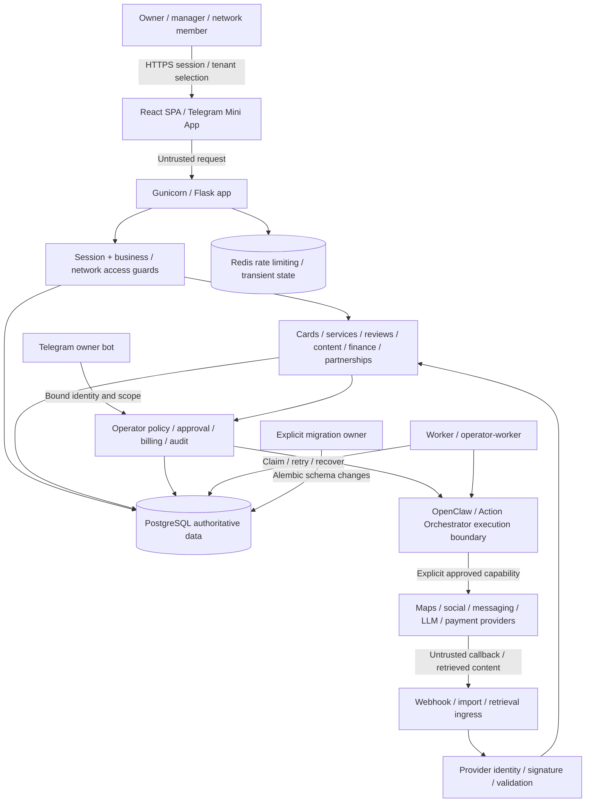

# LocalOS system map — audit working record

Source baseline `30262a5b`. References: `README.md`, `PRODUCT.md`, `AGENTS.md`, `docker-compose.yml`, `docs/LOCALOS_AGENT_ARCHITECTURE_V1.md`. Runtime checks remain incomplete.

## Product and users

LocalOS helps local business owners/managers, local SEO specialists and multi-location networks turn card/review/content/finance/partnership signals into reviewed actions. A successful journey ends with an observable result or a clear recoverable next action, not merely creation of an internal object. Superadmin is a separate platform scope; business and network memberships are tenant boundaries.

## Components, flow and trust boundaries

Provider content/model output are data, not authorization. Signing callbacks does not authorize arbitrary business actions. Dangerous tools must enforce human approval, scoped identity, billing/policy and audit outside prompts.

## Runtime inventory

| Component | Responsibility / source | Important state |
| --- | --- | --- |
| Flask app | `src/main.py`, `src/api/`, `src/legacy_routes/`; HTTP API and SPA | Sessions, request authorization, domain transactions |
| React frontend/public site | `frontend/src/App.tsx`, routes and feature modules; Vite/TypeScript | Browser session/business selection, draft/review state |
| Main worker | `src/worker.py`; parser/jobs and recovery | PostgreSQL claims; `FOR UPDATE SKIP LOCKED` path |
| Operator worker/bot | Compose services and Operator/Telegram modules | Scope-bound commands, confirmations, action journal |
| PostgreSQL 16 + pgvector | Canonical relational runtime database, 168 tracked Alembic version files | Tenants, memberships, business data, approvals, queue and audit |
| Redis | Shared limiter/transient service | Not the durable business source of truth |
| Upload/debug/audio files | Runtime writable storage | Potential private content; separate from read-only source |
| External execution | OpenClaw/orchestrator and provider clients | Timeouts, retries, uncertainty, consent and provider IDs |

Tracked inventory is intentionally not expressed as brittle file counts here. Use the current committed tree for exact paths; file totals are neither coverage nor a runtime-readiness signal.

## Five critical journeys selected for measurement

1. **Access and tenant selection:** sign in → select permitted business → dashboard; expired/inactive/foreign-tenant denial. `auth_admin.py`, `auth_system.py`, `core/auth_helpers.py`.
2. **Service menu change:** view current services → compression/group proposal → review → apply once → see preserved archive/new menu; concurrent apply and rollback integrity. `src/api/services_api.py`.
3. **Finance import:** parse/preview synthetic import → duplicate validation → explicit apply → KPI/history; no cross-tenant writes or partially committed batch. `src/api/finance_api.py`.
4. **Content plan to reviewed draft:** select business → generate/mock draft → review → approval → safe provider stub outcome; no publish merely from preview. `content_plans` / `social_posts` APIs and services.
5. **Operator governed action:** request → scoped proposal → preflight/review → explicit confirmation → journal result, including denied/cancelled/provider-timeout paths. `src/api/operator_api.py`, agent/orchestrator services.

Supervised outreach, reviews and Telegram are mandatory adjacent coverage, including no-send and stop-on-reply. They are not omitted because only five journeys receive the primary performance table.

## Sensitive data and irreversible edges

Credentials, session tokens, provider keys, business finances, private knowledge, uploads, contacts and messages require scoped access and redaction. Publishing, outreach sends, payments, access changes, destructive/bulk actions and provider writes need explicit approval. Do not use real customer data for this audit/demo.

## Deployment reality / unresolved gaps

Compose defines app, worker, operator-worker, Telegram, PostgreSQL, Redis and ancillary services. Base Compose bind-mounts host code over image contents, so image identity alone is not a release attestation. The isolated staging override removes code/env mounts and suppresses integrations. Docker recovery was explicitly approved without reset, prune or volume deletion; recovered task-owned storage evidence does not certify prior user volumes. Alembic has an advisory lock, but multiple startup actors remain a configuration concern. These are audit findings, not instructions to mutate production now.

## Bounded architecture inspection — current `272794a4`

Read-only follow-up checked the source boundaries, not just this diagram.
`main.py` is726lines and `worker.py`7851lines at this revision; size alone
does not establish a correctness defect or justify a rewrite.

| Surface inspected | Observation and disposition |
| --- | --- |
| App construction/registrations (`main.py:230,296`) | Central Flask composition and blueprint registration agree with the runtime map. No contradictory entrypoint found in this scoped check. |
| Legacy route binding (`main.py:691`, `_bind_runtime_namespace`) | Route chunks receive a runtime namespace and are rebound by wrappers. Dependency direction is implicit; ordinary import-graph inspection cannot prove the absence of dynamic cycles. Recorded maintainability debt, not a reproduced request defect. |
| Worker import/configuration (`worker.py:21,128`) | Import-time dotenv/configuration and process-global browser/orchestrator/timing state exist. Audit children explicitly disable dotenv. No import-order or cross-request failure was reproduced by this read-only inspection. |
| Transient caches | Bounded Redis-client/readiness/public-route caches exist, including maxsize2,1,1024 surfaces. Dynamic configuration/cache invalidation is not globally certified; no stale-cache incident was reproduced here. |
| Durable job boundary (`worker.py:5159`, sheet executor/outreach services) | SQL locking/`SKIP LOCKED` claim paths support the map. Multiple domain loops share a large process and transaction boundaries; scoped concurrency/replay tests, not this inspection, establish their tested behavior. |
| Tenant/approval boundaries | Actual stored-role, object-target and approval tests are linked in the backlog. This architecture check does not extend their scope to every route. |

Disposition: keep the current stack and explicit approval boundary. Any worker
or legacy-route extraction should isolate one measured maintenance/failure
surface, preserve its contracts, and run adjacent regression tests. There is
no evidence here supporting a microservice split or a broad rewrite.
